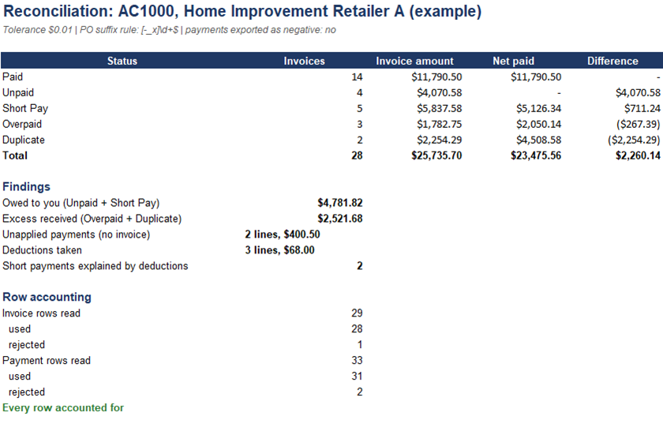

# Dropship Reconciliation Engine


Matches a retailer's invoices against its payments, account by account, and tells you
which invoices are unpaid, short-paid, overpaid or paid twice, which payments belong to
no invoice, and which deductions were taken. The output is an Excel report.

Real invoice and payment exports don't line up cleanly, so most of the work is in the
unglamorous part: reading files whose columns, header rows, PO formats and sign
conventions differ per account. All data here is generated. Nothing comes from a real
client or employer.



## Two things in this repo

1. **A command-line tool** (`reconcile/`) that reads messy exports for any account
   described in `config/accounts.toml` and writes the Excel report above.
2. **The same matching logic written twice** (`src/` and `sql/`), once in pandas and
   once in SQL, run against a generated dataset. Both give identical answers, which is
   how the logic was checked.

## The result statuses

| Status | Meaning |
|---|---|
| Paid | Net paid is within the tolerance of the invoice |
| Unpaid | No payment lines at all |
| Short Pay | Paid less than the invoice |
| Overpaid | Paid more than the invoice |
| Duplicate | Two or more payments whose total is exactly 2x, 3x or 4x the invoice |

Beyond the status, the report lists **unapplied payments** (a PO with no invoice) and
**deductions** (negative lines such as freight or fees, grouped into categories). A short
payment is marked "explained by deductions" when the deductions account for the gap.

## Using the command-line tool

```bash
pip install -r requirements.txt
python examples/make_examples.py          # builds two example accounts (optional)
python -m reconcile --list-accounts
python -m reconcile --account AC1000 \
    --invoices examples/AC1000/invoices.csv \
    --payments examples/AC1000/payments.csv \
    --out output/AC1000_report.xlsx
```

```
Account AC1000: 29 invoice rows, 33 payment rows
  rejected: 1 invoice rows, 2 payment rows (see 'Rejected rows')
  Paid       14
  Unpaid     4
  Short Pay  5
  Overpaid   3
  Duplicate  2
  owed $4,781.82 | excess $2,521.68 | unapplied 2 ($400.50) | deductions 3 ($68.00)
```

Each account is a block in `config/accounts.toml`. Adding an account means adding a
block, not changing code:

| Setting | What it controls |
|---|---|
| column names, `header_row` | Where the PO, amount and date are, and which row holds the headers |
| `po_regex` | A suffix to strip before matching (for example `-1`, `_782`, `x2`) |
| `tolerance` | How many dollars of difference still count as an exact match |
| `payments_are_negative` | Whether money received is exported as a negative number |
| `deductions` | Category names and the words that identify them in the description |

### What it copes with

The two example accounts are built to be awkward on purpose:

- **AC1000:** suffixes on payment POs, amounts like `$1,234.50`, deductions written as
  `($25.00)`, and rows with a missing PO or an amount of `N/A`.
- **AC2000:** three lines of report header above the column names, payments exported as
  negative numbers, POs damaged the way Excel damages them (`2088012076.0` and
  `2.088012077E+9`), and a 5-cent tolerance.

Anything it can't use goes to a **Rejected rows** sheet with the row number and the
reason. It is never silently dropped, and the report ends with a row-count check:
rows read = rows used + rows rejected.

If a column isn't found, the error lists the columns that are in the file, because that
is usually a header-row or spelling problem.

## Design decisions

- **Money is integer cents.** Floats can't hold cents exactly, and two sums that "should"
  match can differ by a fraction. Amounts are parsed by hand from text into cents, so
  `0.1 + 0.2` is exactly 30 and half a cent rounds up.
- **Nothing goes through `float()`.** Python's `float("358208349_782")` quietly returns
  `358208349782.0`. A PO like that would turn into a different number and never match
  anything. POs are cleaned as text, and there's a test for exactly this.
- **Leading zeros in POs are kept.** They can be part of the number.
- **Every account rule lives in config,** so the matching code stays the same.
- **The tests check the engine against known truth.** `make_examples.py` records the
  expected answer for each case as it builds it (for example "3 unpaid, 2 explained by
  deductions"), so the engine is checked against how the data was made, not against its
  own output.

## The engine written twice

`src/match_engine.py` (pandas) and two SQL files run on a generated dataset of 100
invoices and 105 payments (`data/generate_sample_data.py`). Both give **50 paid, 15
unpaid, 15 short pay, 10 overpaid, 10 duplicate**, plus 10 unapplied payments.

| File | Approach |
|---|---|
| `sql/reconciliation_query.sql` | Total the payments per PO in a CTE with `GROUP BY`, then `LEFT JOIN` |
| `sql/reconciliation_window.sql` | `LEFT JOIN` first, then `COUNT() OVER` and `SUM() OVER` per invoice, and `ROW_NUMBER()` to keep one row each |
| `sql/unapplied_payments.sql` | `NOT EXISTS` finds payments with no invoice |

The window version keeps the individual payment rows available in the same query, which
`GROUP BY` throws away. A test checks that the CTE version, the window version and the
pandas engine agree on every invoice.

```bash
python data/generate_sample_data.py
python src/match_engine.py               # pandas
python db/setup_db.py
python src/sql_match_engine.py           # SQL
```

## Tests

```bash
python -m pytest tests -q                # 77 tests
```

They cover PO and amount cleaning (including the underscore trap), every status and the
tolerance boundary, both example accounts against their expected answers, row accounting,
config and file errors, the Excel report, the command line, and SQL/pandas agreement.

## Limits

- The duplicate rule (a total that is an exact multiple of the invoice, over two or more
  lines) is a heuristic. On real data I'd also compare dates and remittance references.
- Matching is on PO only. There is no fuzzy matching, and no carry-forward of a
  partly-paid invoice from one period into the next.
- If several invoice lines share a PO they are added together before matching.
- The Excel summary is live formulas; the invoice sheet holds computed values.

## Layout

```
reconcile/            the command-line tool
  normalize.py        PO and amount cleaning
  config.py           reads config/accounts.toml
  ingest.py           reads CSV or Excel into one standard shape, with rejects
  engine.py           the matching and classification
  report.py           the Excel workbook
config/accounts.toml  one block per account
examples/             two example accounts, and the script that builds them
src/  sql/  db/  data/  schema/   the pandas and SQL versions and their sample data
tests/                77 tests
```

Muhammad Adnan, [LinkedIn](https://linkedin.com/in/muhammad-adnan-740336293),
adnandanish0404@gmail.com
